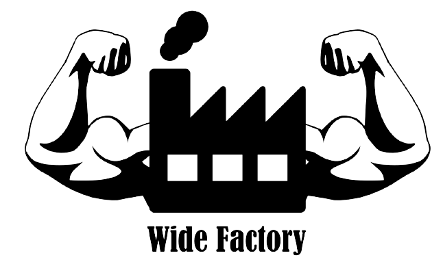

# Wide Factory Client

**Become a greek god**

## Wide Factory Team
* Philippe CORTEZ
* Zack DE SAINT PERN
* Léo BLANC
* Youness ACHOUR
* Kévin-Xavier TOUKAM
* Ahmed AIT OUFQIR
* Régiste DJESSOU

# Goal 
**It's time to take care of yourself**, and become wide like a greek god ! ^ ^  
Our application will help you, to do healthy exercise.  
Thank to Azure Kinect the application detect when a movement is poorly executed  
If you are a coach, our application enable you to record movements and create exercises  

## Installation

To install tool needed for the server visit <a href=https://github.com/Philippe-CORTEZ/Wide_Factory_Serveur_Local/blob/develop/installation/installation_procedure.md>this page</a>.  
For client you need at least a JRE 11+ , then if you don't visit : <a href=https://docs.oracle.com/goldengate/1212/gg-winux/GDRAD/java.htm#BGBFJHAB> oracle web site </a>  

## Launch application

There are two way to launch application, **with or without server**  
You need to start with server if you want to record  
If you just want to see/create exercise the server is not necessary  
Nevertheless an error will prompt but it doesn't impact client application beside record    

Whatever you must download the binary : <a href=#>here</a>  
And execute script  

*launch_server.sh* to launch server  
*launch_client.sh* to launch client

## User Manual

See user manual : <a href=https://github.com/Philippe-CORTEZ/Wide_Factory_Client/blob/develop/manuel_utilisateur.pdf>here</a>    

## Next steps

1. Fully dockerized server (Need to resolve GPU issue)
2. Better handling error
3. Better body tracking error during exercise (Finish thread in websocket server)
4. Login
5. See yourself in real time during exercise (Need to resolve lag issue server side)
6. Command application with movement
7. Distant server
8. Exercise statistic